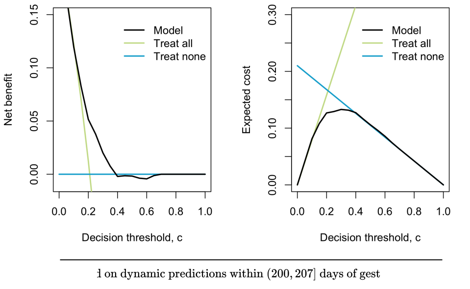

## { data-state="cover-slide" data-background-image="images/cover.png" data-background-size="cover" visibility="uncounted"}

## Motivation {.background-slide}

  - [Evaluate dynamic predictions]{style="color:#EB589A;"} of imminent delivery in pregnancies complicated by early-onset fetal growth restriction (FGR)
  - [Main goal]{style="color:#EB589A;"}: optimizing antenatal corticosteroid (CCS) administration

  

  - Methods are applied to data from the [OPTICORE]{style="color:#EB589A;"} multicenter cohort study 

## Asymmetric misclassification {.background-slide}

  

  [TP]{style="color:#3ECF72;"}

  [FP]{style="color:#FE8330;"}

  [TN]{style="color:#3ECF72;"}

  [FN]{style="color:#FF4040;"}

## Challenges of the data {.background-slide}

-   CCS cannot be administered until the fetus reaches [$500$ grams]{style="color:#EB589A;"} and a gestational age of [$168$ days]{style="color:#EB589A;"} ($24$ weeks)

  

## Definitions and notation {.background-slide}

-   $\require{color}\textcolor{#EB589A}{T_1^*,\dots, T_n^*}$ true time until event
-   $\require{color}\textcolor{#EB589A}{C_1,\dots, C_n}$ right-censoring times
-   $\require{color}\textcolor{#EB589A}{L_1,\dots, L_n}$ left-truncation times
-   $\require{color}\textcolor{#EB589A}{T_i=\min(T_i^*, C_i)}$ observed times, $i=1,\dotsc,n$
-   $\require{color}\textcolor{#EB589A}{\delta_i=\mathbf{1}\{T_i^*\leq C_i\}}$ censoring indicator, $i=1,\dotsc,n$
-   $\require{color}\textcolor{#EB589A}{\boldsymbol{\mathcal{H}}_i(t)}$ available history at time $t$, including baseline and time-dependent covarites

  - [Dynamic predictions]{style="color:#EB589A;"}

  $$
  \normalsize\require{color}
  \pi_{i}(s \mid t)=\operatorname{Pr}\left(T_{i}^* \leq t+s \mid T_{i}^*>t, \colorbox{#EB589A}{$\color{#FBE1EE}\boldsymbol{\mathcal{H}}_i(t)$}\right)
  $$

  

## Scoring rules {.background-slide}

  - We evaluate predictions $\pi_i(s \mid t)$ against the binary indicator $D_i(t,s) = \mathbf{1}\{t<T_i^*\leq t+s\}$ via $\require{color}\textcolor{#EB589A}{\mathcal{S}(\pi_i(s \mid t),D_i(t,s))}$

  - A scoring rule is [proper]{style="color:#EB589A;"} if 
  
  $$ E\left[\mathcal{S}\big(\pi_i^{\text{true}}(s\mid t), D_i(t,s)\big) \right] \leq E\left[\mathcal{S}\big(\widehat{\pi}_i(s\mid t), D_i(t,s)\big) \right] $$
  
  - It is [strictly proper]{style="color:#EB589A;"} if it holds with equality if and only if $\pi_i^{\text{true}}(s\mid t)\equiv \widehat{\pi}_i(s\mid t)$
  - It is [centered]{style="color:#EB589A;"} if $\mathcal{S}(1,1)=\mathcal{S}(0,0)=0$

  

  - The dynamic BS, LogS and AUC quantify predictive accuracy, but not the consequences of decisions based on predictions 
  - They do not account for the asymmetric harms of false-positives and false-negatives decisions

## Clinical utility {.background-slide}

  - Focus on the [quality of decisions]{style="color:#EB589A;"} driven by dynamic predictions
  - Based on a clinically relevant [decision threshold]{style="color:#EB589A;"} $c\in(0,1)$
  - $c$ $\longrightarrow$ cost of false positives;  $1-c$ $\longrightarrow$ cost of false negatives

  

  - The most used clinical utility metric is the [net benefit (NB)]{style="color:#EB589A;"} 
  - We define the [dynamic NB]{style="color:#EB589A;"} 
$$ \normalsize\require{color}\begin{split}
        \text{NB}_c\big(\pi_i(s\mid t),& D_i(t,s)\big)  =  \mathbf{1}\{\pi_i(s\mid t)\geq c\} D_i(t,s)\\
        &-\mathbf{1}\{\pi_i(s\mid t)\geq c\}(1- D_i(t,s))\frac{c}{1-c}
    \end{split} $$ 

  - The most used clinical utility metric is the [net benefit (NB)]{style="color:#EB589A;"} 
  - We define the [dynamic NB]{style="color:#EB589A;"} 
$$ \normalsize\require{color}\begin{split}
        \text{NB}_c\big(\pi_i(s\mid t),& D_i(t,s)\big)  =  \textcolor{#EB589A}{\mathbf{1}\{\pi_i(s\mid t)\geq c\} D_i(t,s)}\\
        &-\mathbf{1}\{\pi_i(s\mid t)\geq c\}(1- D_i(t,s))\frac{c}{1-c}
    \end{split} $$ 

  - The most used clinical utility metric is the [net benefit (NB)]{style="color:#EB589A;"} 
  - We define the [dynamic NB]{style="color:#EB589A;"} 
$$ \normalsize\require{color}\begin{split}
        \text{NB}_c\big(\pi_i(s\mid t),& D_i(t,s)\big)  =  \mathbf{1}\{\pi_i(s\mid t)\geq c\} D_i(t,s)\\
        &-\textcolor{#EB589A}{\mathbf{1}\{\pi_i(s\mid t)\geq c\}(1- D_i(t,s))}\frac{c}{1-c}
    \end{split} $$ 

  - The most used clinical utility metric is the [net benefit (NB)]{style="color:#EB589A;"} 
  - We define the [dynamic NB]{style="color:#EB589A;"} 
$$ \normalsize\require{color}\begin{split}
        \text{NB}_c\big(\pi_i(s\mid t),& D_i(t,s)\big)  =  \mathbf{1}\{\pi_i(s\mid t)\geq c\} D_i(t,s)\\
        &-\mathbf{1}\{\pi_i(s\mid t)\geq c\}(1- D_i(t,s))\textcolor{#EB589A}{\frac{c}{1-c}}
    \end{split} $$ 

  - A similar metric is the [expected cost (EC)]{style="color:#EB589A;"} 
  - We define the [dynamic EC]{style="color:#EB589A;"} 
$$ \normalsize\require{color}\begin{split}
        \begin{split}
        \text{EC}_c\big(\pi_i(s\mid t),&D_i(t,s)\big) = c\mathbf{1}\{\pi_i(s\mid t)\geq c\} (1-D_i(t,s))\\
        &+(1-c)\mathbf{1}\{\pi_i(s\mid t)< c\}D_i(t,s)
    \end{split}
    \end{split} $$ 

  - A similar metric is the [expected cost (EC)]{style="color:#EB589A;"} 
  - We define the [dynamic EC]{style="color:#EB589A;"} 
$$ \normalsize\require{color}\begin{split}
        \begin{split}
        \text{EC}_c\big(\pi_i(s\mid t),&D_i(t,s)\big) = c\textcolor{#EB589A}{\mathbf{1}\{\pi_i(s\mid t)\geq c\} (1-D_i(t,s))}\\
        &+(1-c)\mathbf{1}\{\pi_i(s\mid t)< c\}D_i(t,s)
    \end{split}
    \end{split} $$ 

  - A similar metric is the [expected cost (EC)]{style="color:#EB589A;"} 
  - We define the [dynamic EC]{style="color:#EB589A;"} 
$$ \normalsize\require{color}\begin{split}
        \begin{split}
        \text{EC}_c\big(\pi_i(s\mid t),&D_i(t,s)\big) = \textcolor{#EB589A}{c\mathbf{1}\{\pi_i(s\mid t)\geq c\} (1-D_i(t,s))}\\
        &+(1-c)\mathbf{1}\{\pi_i(s\mid t)< c\}D_i(t,s)
    \end{split}
    \end{split} $$ 

  - A similar metric is the [expected cost (EC)]{style="color:#EB589A;"} 
  - We define the [dynamic EC]{style="color:#EB589A;"} 
$$ \normalsize\require{color}\begin{split}
        \text{EC}_c\big(\pi_i(s\mid t),&D_i(t,s)\big) = c\mathbf{1}\{\pi_i(s\mid t)\geq c\} (1-D_i(t,s))\\
        &+(1-c)\textcolor{#EB589A}{\mathbf{1}\{\pi_i(s\mid t)< c\}D_i(t,s)}
    \end{split} $$ 

  - A similar metric is the [expected cost (EC)]{style="color:#EB589A;"} 
  - We define the [dynamic EC]{style="color:#EB589A;"} 
$$ \normalsize\require{color}\begin{split}
        \text{EC}_c\big(\pi_i(s\mid t),&D_i(t,s)\big) = c\mathbf{1}\{\pi_i(s\mid t)\geq c\} (1-D_i(t,s))\\
        &+\textcolor{#EB589A}{(1-c)\mathbf{1}\{\pi_i(s\mid t)< c\}D_i(t,s)}
    \end{split} $$ 

::: {.fragment .fade-in-then-out}

- NB and EC rely on a single decision threshold $c\in (0,1)$

:::

  - Decision curves allow multiple $c$'s, but they are not scoring rules

  

## Integrated weighted expected cost {.background-slide}

  - To avoid reliance on a single $c$ and achieve strict properness we define the [IWEC]{style="color:#EB589A;"}
  
  $$\normalsize\require{color}\begin{split} & \text{IWEC}_w \big(\pi_i(s\mid t), D_i(t,s)\big) = \\ & \int_0^1\text{EC}_c\big(\pi_i(s\mid t),D_i(t,s)\big)w(c)dc \end{split} $$
  
  - $w(\cdot)$ is a positive weight function reflecting the [clinical relevance of different $c$'s]{style="color:#EB589A;"}

  - To avoid reliance on a single $c$ and achieve strict properness we define the [IWEC]{style="color:#EB589A;"}
  
  $$\normalsize\require{color}\begin{split} & \text{IWEC}_w \big(\pi_i(s\mid t), D_i(t,s)\big) = \\ & \textcolor{#EB589A}{\int_0^1}\text{EC}_c\big(\pi_i(s\mid t),D_i(t,s)\big)\textcolor{#EB589A}{w(c)dc} \end{split} $$
  
  - $w(\cdot)$ is a positive weight function reflecting the [clinical relevance of different $c$'s]{style="color:#EB589A;"}

::: {.fragment .fade-in-then-out}

- We rely on a weight function, [considering all thresholds]{style="color:#EB589A;"} $c\in (0,1)$ and its [relative clinical importance]{style="color:#EB589A;"}

:::

* A scoring rule is centered strictly proper [$\Longleftrightarrow$]{style="color:#EB589A;"} it can be represented by $\text{IWEC}_w \big(\pi_i(s\mid t), D_i(t,s)\big)$
  + For [$w(c)=1$]{style="color:#EB589A;"}, we obtain the dynamic Brier score
  + For [$w(c)=c^{-1}(1-c)^{-1}$]{style="color:#EB589A;"}, we obtain the dynamic logarithmic score

## Estimation under LTRC data {.background-slide}

- We are interested in [estimating]{style="color:#EB589A;"}, the population level target:

$$\text{eIWEC}_w(t,s)=E\big[\text{IWEC}_w\big(\pi(s\mid t),D(t,s)\big) \mid T^*>t\big]$$

- We must account for the challenges posed by the data

- Under LTRC data $D_i(t,s)=\mathbf{1}\{t<T_i^*\leq t+s\}$ is unobserved for $i$ censored within $(t, t+s]$ or $L_i>t$

- Under LTRC data $D_i(t,s)=\mathbf{1}\{t<T_i^*\leq t+s\}$ is unobserved for $i$ censored within $(t, t+s]$ or $L_i>t$

* We address this problem defining the [IPW estimator]{style="color:#EB589A;"}

$$\require{color} \widehat{\text{eIWEC}_w}(t,s)=\frac{1}{n_t} \sum_{i=1}^n \widehat{W}_i(t,s)\text{IWEC}_w\big(\pi_i(s\mid t),\tilde{D}_i(t,s)\big)$$

  + $n_t$ number of individuals at risk at $t$
  + $\tilde{D}_i(t,s)=\mathbf{1}\{L_i<t<T_i\leq t+s,\delta_i=1\}$ the observed binary indicator

* We address this problem defining the [IPW estimator]{style="color:#EB589A;"}

$$ \require{color}\widehat{\text{eIWEC}_w}(t,s)=\frac{1}{\textcolor{#EB589A}{n_t}} \sum_{i=1}^n \widehat{W}_i(t,s)\text{IWEC}_w\big(\pi_i(s\mid t),\tilde{D}_i(t,s)\big)$$

  + $\textcolor{#EB589A}{n_t}$ number of individuals at risk at $t$
  + $\tilde{D}_i(t,s)=\mathbf{1}\{L_i<t<T_i\leq t+s,\delta_i=1\}$ the observed binary indicator

* We address this problem defining the [IPW estimator]{style="color:#EB589A;"}

$$\require{color} \widehat{\text{eIWEC}_w}(t,s)=\frac{1}{n_t} \sum_{i=1}^n \widehat{W}_i(t,s)\text{IWEC}_w\big(\pi_i(s\mid t),\textcolor{#EB589A}{\tilde{D}_i(t,s)}\big)$$

  + $n_t$ number of individuals at risk at $t$
  + $\textcolor{#EB589A}{\tilde{D}_i(t,s)=\mathbf{1}\{L_i<t<T_i\leq t+s,\delta_i=1\}}$ the observed binary indicator

* The [weights]{style="color:#EB589A;"} are defined as 

$$\small\require{color} \widehat{W}_i(t,s)=\frac{\mathbf{1}\{T_i>t+s\}\mathbf{1}\{L_i<t\}}{\widehat{G}(t+s\mid t)} + \frac{\mathbf{1}\{L_i<t<T_i\leq t+s\} \delta_i}{\widehat{G}(T_i\mid t)}$$

  + $\widehat{G}(\cdot)$ is the Kaplan-Meier estimator for the survival function of the censoring time, adjusting the risk sets for left-truncation

* The [weights]{style="color:#EB589A;"} are defined as 

$$\small\require{color} \widehat{W}_i(t,s)=\frac{\mathbf{1}\{T_i>t+s\}\mathbf{1}\{L_i<t\}}{\textcolor{#EB589A}{\widehat{G}(}t+s\mid t\textcolor{#EB589A}{)}} + \frac{\mathbf{1}\{L_i<t<T_i\leq t+s\} \delta_i}{\textcolor{#EB589A}{\widehat{G}(}T_i\mid t\textcolor{#EB589A}{)}}$$

  + $\textcolor{#EB589A}{\widehat{G}(\cdot)}$ is the Kaplan-Meier estimator for the survival function of the censoring time, adjusting the risk sets for left-truncation

* We demostrated that
  + $\widehat{\text{eIWEC}_w}(t,s)$ is a [consistent]{style="color:#EB589A;"} estimator of $\text{eIWEC}_w(t,s)$
  + $\sqrt{n}\big(\widehat{\text{eIWEC}_w}(t,s)-\text{eIWEC}_w(t,s)\big) \textcolor{#EB589A}{\xrightarrow{d}} N(0, \sigma^2(t,s))$ 

* This result applies to [all centered strictly proper metrics]{style="color:#EB589A;"}, including the dynamic Brier score and logarithmic score

## Application: OPTICORE {.background-slide}

* [Baseline covariates]{style="color:#EB589A;"}: age, previous pregnancy outcomes, smoking status, pre-existent use of antihypertensive agents, diabetes mellitus, etc.
* We consider [fetal longitudinal biomarkers]{style="color:#EB589A;"}:
  + Pulsatility index of the umbilical artery [($\texttt{PI_UA}$)]{style="color:#EB589A;"}
  + Pulsatility index of the middle cerebral artery [($\texttt{PI_MCA}$)]{style="color:#EB589A;"}
  + Estimated fetal weight [($\texttt{EFW}$)]{style="color:#EB589A;"}
  + Short-term variation in fetal heart rate [($\texttt{STV}$)]{style="color:#EB589A;"}
* And [maternal longitudinal biomarkers]{style="color:#EB589A;"}:
  + Systolic blood pressure [($\texttt{sBP}$)]{style="color:#EB589A;"}

$$ \require{color}\scriptsize\begin{cases}
         \texttt{PI_UA}_i(t) & = \colorbox{#EB589A}{$\color{#FBE1EE}m_{1i}(t)$} + \varepsilon_{1i}(t) \\
        &=  (\beta_0^1 + b_{0i}^1) + (\beta_{1}^1 + b_{1i}^1)B_1(t,\lambda) +  (\beta_{2}^1 + b_{2i}^1)B_2(t,\lambda)  + \varepsilon_{1i}(t),\\
         \texttt{PI_MCA}_i(t) & = \colorbox{#EB589A}{$\color{#FBE1EE}m_{2i}(t)$} + \varepsilon_{2i}(t) \\
         & = (\beta_0^2 + b_{0i}^2) + (\beta_{1}^2 + b_{1i}^2)B_1(t,\lambda) +  (\beta_{2}^2 + b_{2i}^2)B_2(t,\lambda)  + \varepsilon_{2i}(t),\\
          \texttt{EFW}_i(t) & = \colorbox{#EB589A}{$\color{#FBE1EE}m_{3i}(t)$} + \varepsilon_{3i}(t) \\
        & =(\beta_0^3 + b_{0i}^3) + \sum_{j=1}^3(\beta_{j}^3 + b_{ji}^3)B_j(t,\lambda)  + \varepsilon_{3i}(t),\\
        \log(\texttt{STV}_i(t)) & = \colorbox{#EB589A}{$\color{#FBE1EE}m_{4i}(t)$} + \varepsilon_{4i}(t)\\
        & = (\beta_0^4 + b_{0i}^4) + (\beta_{1}^4 + b_{1i}^4)B_1(t,\lambda) +  (\beta_{2}^4 + b_{2i}^4)B_2(t,\lambda)  + \varepsilon_{4i}(t),\\
        \texttt{sBP}_i(t) & = \colorbox{#EB589A}{$\color{#FBE1EE}m_{5i}(t)$} + \varepsilon_{5i}(t)\\
        & = (\beta_0^5 + b_{0i}^5) + \sum_{j=1}^3(\beta_{j}^5 + b_{ji}^5)B_j(t,\lambda)   + \varepsilon_{5i}(t),
    \end{cases}$$

- We fit five [joint models]{style="color:#EB589A;"} using the baseline data and the longitudinal submodels:

$$\scriptsize\begin{cases} 
M1: & h_{i}\left(t \mid \colorbox{#D2691E}{$\color{white}\boldsymbol{\mathcal{Y}}_{i}(t)$}, \colorbox{#2E8B57}{$\color{white}\boldsymbol{w}_{i}$}\right) =h_{0}(t) \exp \big(  \colorbox{#2E8B57}{$\color{white}\gamma\texttt{drug}_i$}+ \alpha_1\colorbox{#D2691E}{$\color{white}m_{1i}(t_{ij})$} \big) \\
M2: & h_{i}\left(t \mid \colorbox{#D2691E}{$\color{white}\boldsymbol{\mathcal{Y}}_{i}(t)$}, \colorbox{#2E8B57}{$\color{white}\boldsymbol{w}_{i}$}\right) =h_{0}(t) \exp \big(  \colorbox{#2E8B57}{$\color{white}\gamma\texttt{drug}_i$}+ \alpha_2\colorbox{#D2691E}{$\color{white}m_{2i}(t_{ij})$} \big) \\
M3: & h_{i}\left(t \mid \colorbox{#D2691E}{$\color{white}\boldsymbol{\mathcal{Y}}_{i}(t)$}, \colorbox{#2E8B57}{$\color{white}\boldsymbol{w}_{i}$}\right) =h_{0}(t) \exp \big(  \colorbox{#2E8B57}{$\color{white}\gamma\texttt{drug}_i$}+ \alpha_3\colorbox{#D2691E}{$\color{white}m_{3i}(t_{ij})$} \big) \\
M4: & h_{i}\left(t \mid \colorbox{#D2691E}{$\color{white}\boldsymbol{\mathcal{Y}}_{i}(t)$}, \colorbox{#2E8B57}{$\color{white}\boldsymbol{w}_{i}$}\right) =h_{0}(t) \exp \big(  \colorbox{#2E8B57}{$\color{white}\gamma\texttt{drug}_i$}+ \alpha_4\colorbox{#D2691E}{$\color{white}m_{4i}(t_{ij})$} \big) 
\end{cases}$$

