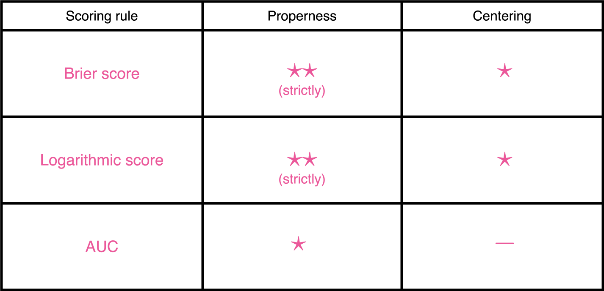
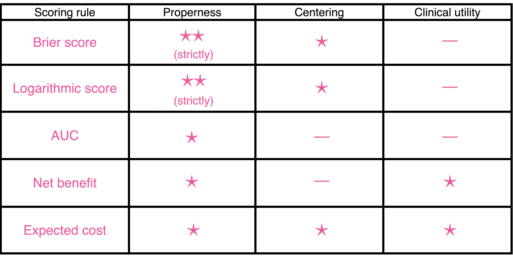
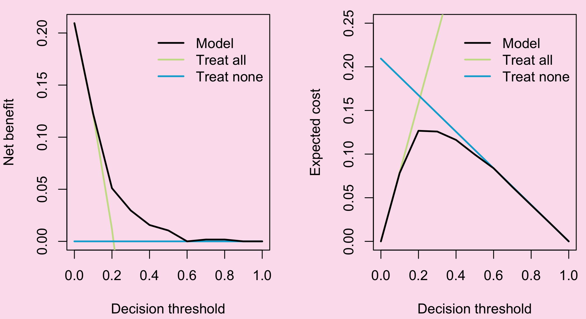

## { data-state="cover-slide" data-background-image="images/cover.png" data-background-size="cover" visibility="uncounted"}

## Motivation {.background-slide}

  - [Evaluate dynamic predictions]{style="color:#FF69B4;"} of imminent delivery in pregnancies complicated by early-onset fetal growth restriction (FGR)
  - [Main goal]{style="color:#FF69B4;"}: optimizing antenatal corticosteroid (CCS) administration

  

  - Methods are applied to data from the [OPTICORE]{style="color:#FF69B4;"} multicenter cohort study 

## Asymmetric misclassification {.background-slide}

  

  [TP]{style="color:#3ECF72;"}

  [FP]{style="color:#FE8330;"}

  [TN]{style="color:#3ECF72;"}

  [FN]{style="color:#FF4040;"}

## Challenges of the data {.background-slide}

-   CCS cannot be administered until the fetus reaches [$500$ grams]{style="color:#FF69B4;"} and a gestational age of [$168$ days]{style="color:#FF69B4;"} ($24$ weeks)

  

## Definitions and notation {.background-slide}

-   $\require{color}\textcolor{#FF69B4}{T_1^*,\dots, T_n^*}$ true time until event
-   $\require{color}\textcolor{#FF69B4}{C_1,\dots, C_n}$ right-censoring times
-   $\require{color}\textcolor{#FF69B4}{L_1,\dots, L_n}$ left-truncation times
-   $\require{color}\textcolor{#FF69B4}{T_i=\min(T_i^*, C_i)}$ observed times, $i=1,\dotsc,n$
-   $\require{color}\textcolor{#FF69B4}{\delta_i=\mathbf{1}\{T_i^*\leq C_i\}}$ censoring indicator, $i=1,\dotsc,n$
-   $\require{color}\textcolor{#FF69B4}{\boldsymbol{\mathcal{H}}_i(t)}$ available history at time $t$, including baseline and time-dependent covarites

  - [Dynamic predictions]{style="color:#FF69B4;"}

  $$
  \normalsize\require{color}
  \pi_{i}(s \mid t)=\operatorname{Pr}\left(T_{i}^* \leq t+s \mid T_{i}^*>t, \colorbox{#2E8B57}{$\color{#FBE1EE}\boldsymbol{\mathcal{H}}_i(t)$}\right)
  $$

  

## Scoring rules {.background-slide}

  - We evaluate predictions $\pi_i(s \mid t)$ against the binary indicator $D_i(t,s) = \mathbf{1}\{t<T_i^*\leq t+s\}$ via $\require{color}\textcolor{#FF69B4}{\mathcal{S}(\pi_i(s \mid t),D_i(t,s))}$

  - A scoring rule is [proper]{style="color:#FF69B4;"} if 
  
  $$ E\left[\mathcal{S}\big(\pi_i^{\text{true}}(s\mid t), D_i(t,s)\big) \right] \leq E\left[\mathcal{S}\big(\widehat{\pi}_i(s\mid t), D_i(t,s)\big) \right] $$
  
  - It is [strictly proper]{style="color:#FF69B4;"} if it holds with equality if and only if $\pi_i^{\text{true}}(s\mid t)\equiv \widehat{\pi}_i(s\mid t)$
  - It is [centered]{style="color:#FF69B4;"} if $\mathcal{S}(1,1)=\mathcal{S}(0,0)=0$

  

  - The dynamic BS, LogS and AUC quantify predictive accuracy, but not the consequences of decisions based on predictions 
  - They do not account for the asymmetric harms of false-positives and false-negatives decisions

## Clinical utility {.background-slide}

  - Focus on the [quality of decisions]{style="color:#FF69B4;"} driven by dynamic predictions
  - Based on a clinically relevant [decision threshold]{style="color:#FF69B4;"} $c\in(0,1)$
  - $c$ $\longrightarrow$ cost of false positives;  $1-c$ $\longrightarrow$ cost of false negatives

  

  - The most used clinical utility metric is the [net benefit (NB)]{style="color:#FF69B4;"} 
  - We define the [dynamic NB]{style="color:#FF69B4;"} 
$$ \normalsize\require{color}\begin{split}
        \text{NB}_c\big(\pi_i(s\mid t),& D_i(t,s)\big)  =  \mathbf{1}\{\pi_i(s\mid t)\geq c\} D_i(t,s)\\
        &-\mathbf{1}\{\pi_i(s\mid t)\geq c\}(1- D_i(t,s))\frac{c}{1-c}
    \end{split} $$ 

  - The most used clinical utility metric is the [net benefit (NB)]{style="color:#FF69B4;"} 
  - We define the [dynamic NB]{style="color:#FF69B4;"} 
$$ \normalsize\require{color}\begin{split}
        \text{NB}_c\big(\pi_i(s\mid t),& D_i(t,s)\big)  =  \textcolor{#FF69B4}{\mathbf{1}\{\pi_i(s\mid t)\geq c\} D_i(t,s)}\\
        &-\mathbf{1}\{\pi_i(s\mid t)\geq c\}(1- D_i(t,s))\frac{c}{1-c}
    \end{split} $$ 

  - The most used clinical utility metric is the [net benefit (NB)]{style="color:#FF69B4;"} 
  - We define the [dynamic NB]{style="color:#FF69B4;"} 
$$ \normalsize\require{color}\begin{split}
        \text{NB}_c\big(\pi_i(s\mid t),& D_i(t,s)\big)  =  \mathbf{1}\{\pi_i(s\mid t)\geq c\} D_i(t,s)\\
        &-\textcolor{#FF69B4}{\mathbf{1}\{\pi_i(s\mid t)\geq c\}(1- D_i(t,s))}\frac{c}{1-c}
    \end{split} $$ 

  - The most used clinical utility metric is the [net benefit (NB)]{style="color:#FF69B4;"} 
  - We define the [dynamic NB]{style="color:#FF69B4;"} 
$$ \normalsize\require{color}\begin{split}
        \text{NB}_c\big(\pi_i(s\mid t),& D_i(t,s)\big)  =  \mathbf{1}\{\pi_i(s\mid t)\geq c\} D_i(t,s)\\
        &-\mathbf{1}\{\pi_i(s\mid t)\geq c\}(1- D_i(t,s))\textcolor{#FF69B4}{\frac{c}{1-c}}
    \end{split} $$ 

  - A similar metric is the [expected cost (EC)]{style="color:#FF69B4;"} 
  - We define the [dynamic EC]{style="color:#FF69B4;"} 
$$ \normalsize\require{color}\begin{split}
        \begin{split}
        \text{EC}_c\big(\pi_i(s\mid t),&D_i(t,s)\big) = c\mathbf{1}\{\pi_i(s\mid t)\geq c\} (1-D_i(t,s))\\
        &+(1-c)\mathbf{1}\{\pi_i(s\mid t)< c\}D_i(t,s)
    \end{split}
    \end{split} $$ 

  - A similar metric is the [expected cost (EC)]{style="color:#FF69B4;"} 
  - We define the [dynamic EC]{style="color:#FF69B4;"} 
$$ \normalsize\require{color}\begin{split}
        \begin{split}
        \text{EC}_c\big(\pi_i(s\mid t),&D_i(t,s)\big) = c\textcolor{#FF69B4}{\mathbf{1}\{\pi_i(s\mid t)\geq c\} (1-D_i(t,s))}\\
        &+(1-c)\mathbf{1}\{\pi_i(s\mid t)< c\}D_i(t,s)
    \end{split}
    \end{split} $$ 

  - A similar metric is the [expected cost (EC)]{style="color:#FF69B4;"} 
  - We define the [dynamic EC]{style="color:#FF69B4;"} 
$$ \normalsize\require{color}\begin{split}
        \begin{split}
        \text{EC}_c\big(\pi_i(s\mid t),&D_i(t,s)\big) = \textcolor{#FF69B4}{c\mathbf{1}\{\pi_i(s\mid t)\geq c\} (1-D_i(t,s))}\\
        &+(1-c)\mathbf{1}\{\pi_i(s\mid t)< c\}D_i(t,s)
    \end{split}
    \end{split} $$ 

  - A similar metric is the [expected cost (EC)]{style="color:#FF69B4;"} 
  - We define the [dynamic EC]{style="color:#FF69B4;"} 
$$ \normalsize\require{color}\begin{split}
        \text{EC}_c\big(\pi_i(s\mid t),&D_i(t,s)\big) = c\mathbf{1}\{\pi_i(s\mid t)\geq c\} (1-D_i(t,s))\\
        &+(1-c)\textcolor{#FF69B4}{\mathbf{1}\{\pi_i(s\mid t)< c\}D_i(t,s)}
    \end{split} $$ 

  - A similar metric is the [expected cost (EC)]{style="color:#FF69B4;"} 
  - We define the [dynamic EC]{style="color:#FF69B4;"} 
$$ \normalsize\require{color}\begin{split}
        \text{EC}_c\big(\pi_i(s\mid t),&D_i(t,s)\big) = c\mathbf{1}\{\pi_i(s\mid t)\geq c\} (1-D_i(t,s))\\
        &+\textcolor{#FF69B4}{(1-c)\mathbf{1}\{\pi_i(s\mid t)< c\}D_i(t,s)}
    \end{split} $$ 

::: {.fragment .fade-in-then-out}

- NB and EC rely on a single decision threshold $c\in (0,1)$

:::

  - Decision curves allow multiple $c$'s, but they are not scoring rules

  

## Integrated weighted expected cost {.background-slide}

  - To avoid reliance on a single $c$ and achieve strict properness we define the [IWEC]{style="color:#FF69B4;"}
  
  $$\normalsize\require{color}\begin{split} & \text{IWEC}_w \big(\pi_i(s\mid t), D_i(t,s)\big) = \\ & \int_0^1\text{EC}_c\big(\pi_i(s\mid t),D_i(t,s)\big)w(c)dc \end{split} $$
  
  - $w(\cdot)$ is a positive weight function reflecting the [clinical relevance of different $c$'s]{style="color:#FF69B4;"}

  - To avoid reliance on a single $c$ and achieve strict properness we define the [IWEC]{style="color:#FF69B4;"}
  
  $$\normalsize\require{color}\begin{split} & \text{IWEC}_w \big(\pi_i(s\mid t), D_i(t,s)\big) = \\ & \textcolor{#FF69B4}{\int_0^1}\text{EC}_c\big(\pi_i(s\mid t),D_i(t,s)\big)\textcolor{#FF69B4}{w(c)dc} \end{split} $$
  
  - $w(\cdot)$ is a positive weight function reflecting the [clinical relevance of different $c$'s]{style="color:#FF69B4;"}

::: {.fragment .fade-in-then-out}

- We rely on a weight function, considering all thresholds $c\in (0,1)$ and its relative clinical importance

:::

* A scoring rule is centered strictly proper [$\Longleftrightarrow$]{style="color:#FF69B4;"} it can be represented by $\text{IWEC}_w \big(\pi_i(s\mid t), D_i(t,s)\big)$
  + For [$w(c)=1$]{style="color:#FF69B4;"}, we obtain the dynamic Brier score
  + For [$w(c)=c^{-1}(1-c)^{-1}$]{style="color:#FF69B4;"}, we obtain the logarithmic score

## Estimation under LTRC data {.background-slide}

