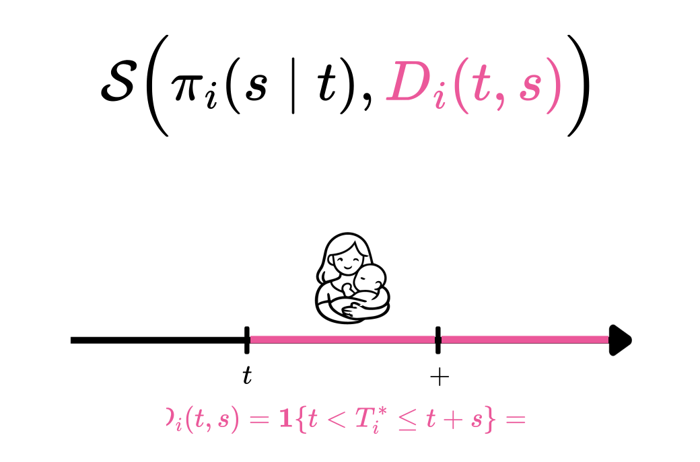
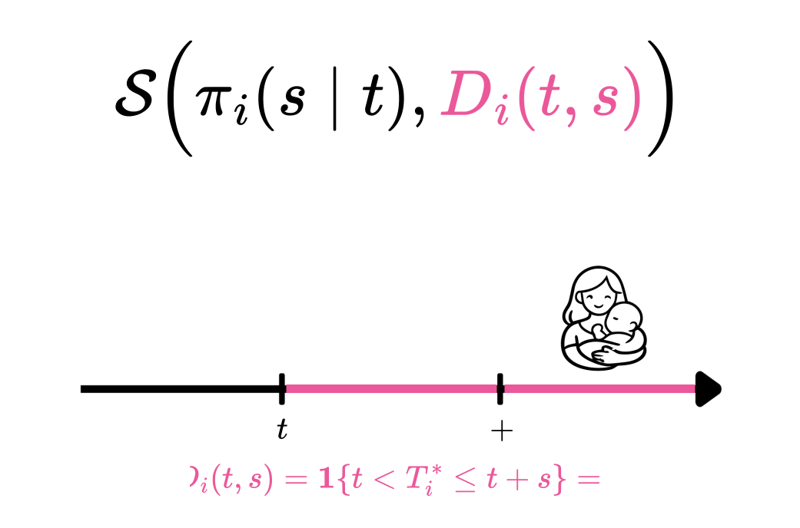
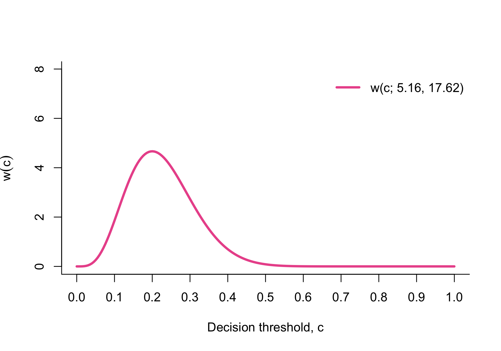
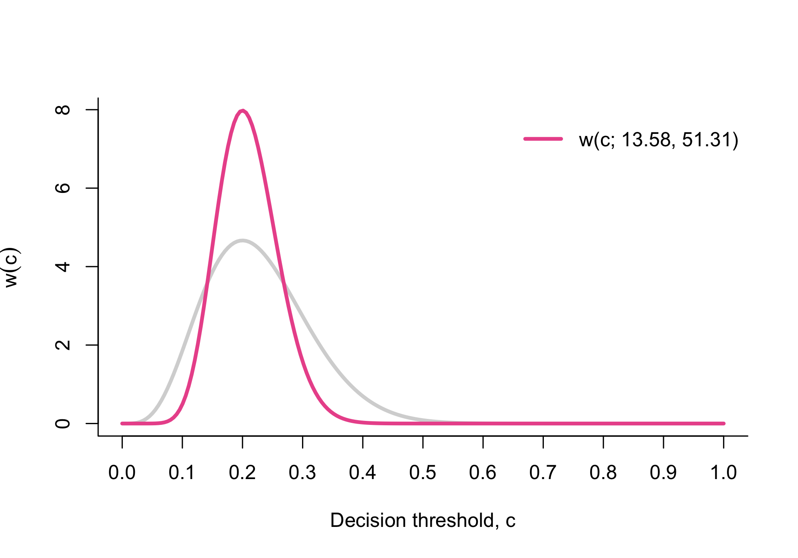
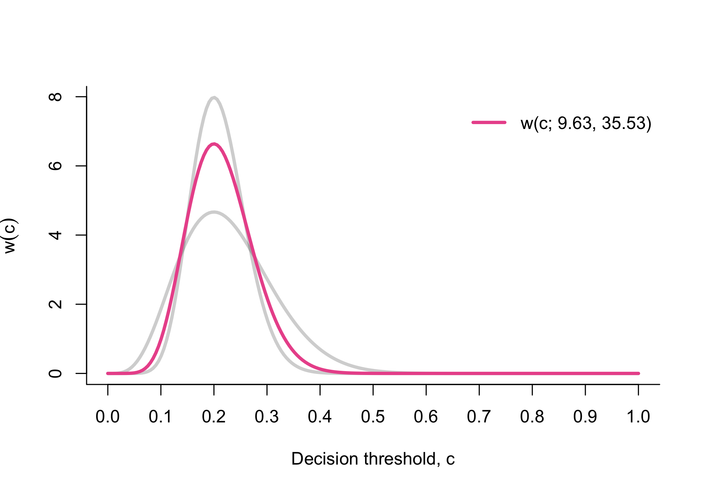
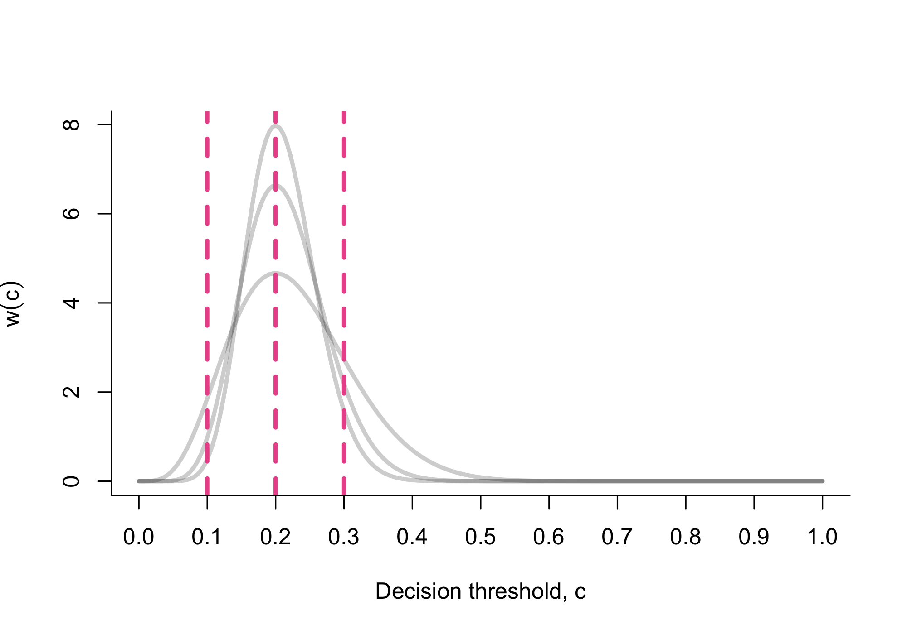
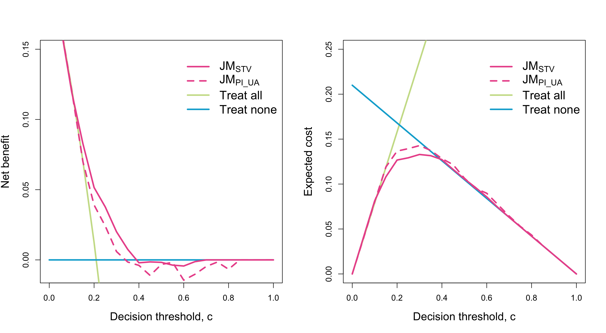
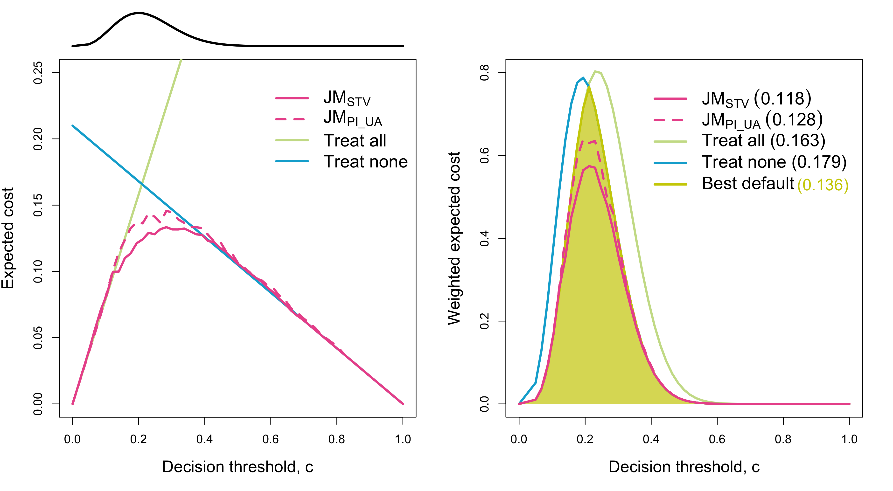

## { data-state="cover-slide" data-background-image="images/cover.png" data-background-size="cover" visibility="uncounted"}

## Motivation {.background-slide}

  - [Evaluate dynamic predictions]{style="color:#EB589A;"} of imminent delivery in pregnancies complicated by early-onset fetal growth restriction (FGR)
  - [Main goal]{style="color:#EB589A;"}: optimizing antenatal corticosteroid (CCS) administration

  

  - Methods are applied to data from the [OPTICORE]{style="color:#EB589A;"} multicenter cohort study 

## Asymmetric misclassification {.background-slide}

  

  [TP]{style="color:#228B22;"}

  [FP]{style="color:#FE8330;"}

  [TN]{style="color:#228B22;"}

  [FN]{style="color:#D30000;"}

## Definitions and notation {.background-slide}

-   $\require{color}\textcolor{#EB589A}{T_1^*,\dots, T_n^*}$ true time until event
-   $\require{color}\textcolor{#EB589A}{C_1,\dots, C_n}$ right-censoring times
-   $\require{color}\textcolor{#EB589A}{L_1,\dots, L_n}$ left-truncation times
-   $\require{color}\textcolor{#EB589A}{T_i=\min(T_i^*, C_i)}$ observed times, $i=1,\dotsc,n$
-   $\require{color}\textcolor{#EB589A}{\delta_i=\mathbf{1}\{T_i^*\leq C_i\}}$ censoring indicator, $i=1,\dotsc,n$
-   $\require{color}\textcolor{#EB589A}{\boldsymbol{\mathcal{H}}_i(t)}$ available history at time $t$, including baseline and time-dependent covarites

  - [Dynamic predictions]{style="color:#EB589A;"}

  $$
  \normalsize\require{color}
  \pi_{i}(s \mid t)=\operatorname{Pr}\left(T_{i}^* \leq t+s \mid T_{i}^*>t, \colorbox{#EB589A}{$\color{#FBE1EE}\boldsymbol{\mathcal{H}}_i(t)$}\right)
  $$

  

## Scoring rules {.background-slide}

  

  

  

  - A scoring rule is [proper]{style="color:#EB589A;"} if 
  
  $$ E\left[\mathcal{S}\big(\pi_i^{\text{true}}(s\mid t), D_i(t,s)\big) \right] \leq E\left[\mathcal{S}\big(\widehat{\pi}_i(s\mid t), D_i(t,s)\big) \right] $$
  
  - It is [strictly proper]{style="color:#EB589A;"} if it holds with equality if and only if $\pi_i^{\text{true}}(s\mid t)\equiv \widehat{\pi}_i(s\mid t)$
  - It is [centered]{style="color:#EB589A;"} if $\mathcal{S}(1,1)=\mathcal{S}(0,0)=0$

  

  - They quantify predictive accuracy, but [not the consequences of decisions based on predictions]{style="color:#EB589A;"}
  - They do not account for the [asymmetric harms of false-positives and false-negatives]{style="color:#EB589A;"} decisions

## Clinical utility {.background-slide}

  - Focus on the [quality of decisions]{style="color:#EB589A;"} driven by dynamic predictions
  - Based on a clinically relevant [decision threshold]{style="color:#EB589A;"} $c\in(0,1)$

  

  - The most used clinical utility metric is the [net benefit (NB)]{style="color:#EB589A;"} 
  - A similar metric is the [expected cost (EC)]{style="color:#EB589A;"} 
  - We define the [dynamic EC]{style="color:#EB589A;"} 
$$ \normalsize\require{color}\begin{split}
        \begin{split}
        \text{EC}_c\big(\pi_i(s\mid t),&D_i(t,s)\big) = c\mathbf{1}\{\pi_i(s\mid t)\geq c\} (1-D_i(t,s))\\
        &+(1-c)\mathbf{1}\{\pi_i(s\mid t)< c\}D_i(t,s)
    \end{split}
    \end{split} $$ 

  - The most used clinical utility metric is the [net benefit (NB)]{style="color:#EB589A;"} 
  - A similar metric is the [expected cost (EC)]{style="color:#EB589A;"} 
  - We define the [dynamic EC]{style="color:#EB589A;"} 
$$ \normalsize\require{color}\begin{split}
        \begin{split}
        \text{EC}_c\big(\pi_i(s\mid t),&D_i(t,s)\big) = c\textcolor{#EB589A}{\mathbf{1}\{\pi_i(s\mid t)\geq c\} (1-D_i(t,s))}\\
        &+(1-c)\mathbf{1}\{\pi_i(s\mid t)< c\}D_i(t,s)
    \end{split}
    \end{split} $$ 

  - The most used clinical utility metric is the [net benefit (NB)]{style="color:#EB589A;"} 
  - A similar metric is the [expected cost (EC)]{style="color:#EB589A;"} 
  - We define the [dynamic EC]{style="color:#EB589A;"} 
$$ \normalsize\require{color}\begin{split}
        \begin{split}
        \text{EC}_c\big(\pi_i(s\mid t),&D_i(t,s)\big) = \textcolor{#EB589A}{c\mathbf{1}\{\pi_i(s\mid t)\geq c\} (1-D_i(t,s))}\\
        &+(1-c)\mathbf{1}\{\pi_i(s\mid t)< c\}D_i(t,s)
    \end{split}
    \end{split} $$ 

  - The most used clinical utility metric is the [net benefit (NB)]{style="color:#EB589A;"} 
  - A similar metric is the [expected cost (EC)]{style="color:#EB589A;"} 
  - We define the [dynamic EC]{style="color:#EB589A;"} 
$$ \normalsize\require{color}\begin{split}
        \text{EC}_c\big(\pi_i(s\mid t),&D_i(t,s)\big) = c\mathbf{1}\{\pi_i(s\mid t)\geq c\} (1-D_i(t,s))\\
        &+(1-c)\textcolor{#EB589A}{\mathbf{1}\{\pi_i(s\mid t)< c\}D_i(t,s)}
    \end{split} $$ 

  - The most used clinical utility metric is the [net benefit (NB)]{style="color:#EB589A;"} 
  - A similar metric is the [expected cost (EC)]{style="color:#EB589A;"} 
  - We define the [dynamic EC]{style="color:#EB589A;"} 
$$ \normalsize\require{color}\begin{split}
        \text{EC}_c\big(\pi_i(s\mid t),&D_i(t,s)\big) = c\mathbf{1}\{\pi_i(s\mid t)\geq c\} (1-D_i(t,s))\\
        &+\textcolor{#EB589A}{(1-c)\mathbf{1}\{\pi_i(s\mid t)< c\}D_i(t,s)}
    \end{split} $$ 

::: {.fragment .fade-in}

- NB and EC rely on a [single decision threshold]{style="color:#EB589A;"}  $c\in (0,1)$

:::

## Integrated weighted expected cost {.background-slide}

  - To avoid reliance on a single $c$ and achieve strict properness we define the [IWEC]{style="color:#EB589A;"}
  
  $$\normalsize\require{color}\begin{split} & \text{IWEC}_w \big(\pi_i(s\mid t), D_i(t,s)\big) = \\ & \int_0^1\text{EC}_c\big(\pi_i(s\mid t),D_i(t,s)\big)w(c)dc \end{split} $$
  
  - $w(\cdot)$ is a positive weight function reflecting the [clinical relevance of different $c$'s]{style="color:#EB589A;"}

  - To avoid reliance on a single $c$ and achieve strict properness we define the [IWEC]{style="color:#EB589A;"}
  
  $$\normalsize\require{color}\begin{split} & \text{IWEC}_w \big(\pi_i(s\mid t), D_i(t,s)\big) = \\ & \textcolor{#EB589A}{\int_0^1}\text{EC}_c\big(\pi_i(s\mid t),D_i(t,s)\big)\textcolor{#EB589A}{w(c)dc} \end{split} $$
  
  - $w(\cdot)$ is a positive weight function reflecting the [clinical relevance of different $c$'s]{style="color:#EB589A;"}

  - To avoid reliance on a single $c$ and achieve strict properness we define the [IWEC]{style="color:#EB589A;"}
  
  $$\normalsize\require{color}\begin{split} & \text{IWEC}_w \big(\pi_i(s\mid t), D_i(t,s)\big) = \\ & \textcolor{#EB589A}{\int_0^1}\text{EC}_c\big(\pi_i(s\mid t),D_i(t,s)\big)\textcolor{#EB589A}{w(c)dc} \end{split} $$
  
  - We consider the [Beta family]{style="color:#EB589A;"} of weight functions [$w(c;\alpha,\beta)$]{style="color:#EB589A;"}

::: {.fragment .fade-in-then-out}

- We rely on a weight function, [considering all thresholds]{style="color:#EB589A;"} $c\in (0,1)$ and its [relative clinical importance]{style="color:#EB589A;"}

:::

* A scoring rule is centered strictly proper [$\Longleftrightarrow$]{style="color:#EB589A;"} it can be represented by $\text{IWEC}_w \big(\pi_i(s\mid t), D_i(t,s)\big)$ for some $w(\cdot)$
  + For [$w(c)=1$]{style="color:#EB589A;"}, we obtain the dynamic Brier score
  + For [$w(c)=c^{-1}(1-c)^{-1}$]{style="color:#EB589A;"}, we obtain the dynamic logarithmic score

## Estimation under LTRC data {.background-slide}

- To [estimate]{style="color:#EB589A;"}:

$$\text{eIWEC}_w(t,s)=E\big[\text{IWEC}_w\big(\pi(s\mid t),D(t,s)\big) \mid T^*>t\big]$$

- We propose a nonparametric IPW estimator [$\widehat{\text{eIWEC}_w}(t,s)$]{style="color:#EB589A;"}, tailored to LTRC data
- We established its [consistency]{style="color:#EB589A;"} and [asymptotic normality]{style="color:#EB589A;"}

## Simulation study {.background-slide}

* We [evaluate dynamic predictions]{style="color:#EB589A;"} within $(1,3]$ obtained via three Cox proportional-hazards models:
  + The true model $\longrightarrow$ [$M_\text{True}$]{style="color:#EB589A;"}
  + Two misspecified models $\longrightarrow$ [$M_1, M_2$]{style="color:#EB589A;"}
* To reflect the [asymmetry between FP and FN]{style="color:#EB589A;"} in our clinical context, we set [$c\in(0.1, 0.3)$]{style="color:#EB589A;"}

  

  

  

  

  

## Application: OPTICORE {.background-slide}

* [Baseline covariates]{style="color:#EB589A;"}: age, previous pregnancy outcomes, smoking status, pre-existent use of antihypertensive agents, diabetes mellitus, etc.
* We consider [fetal longitudinal biomarkers]{style="color:#EB589A;"}:
  + Pulsatility index of the umbilical artery [($\texttt{PI_UA}$)]{style="color:#EB589A;"}
  + Short-term heart-rate variability [($\texttt{STV}$)]{style="color:#EB589A;"}

- [Linear mixed-effect]{style="color:#EB589A;"} models with natural cubic splines:

$$ \require{color}\scriptsize\begin{cases}
         \texttt{PI_UA}_i(t) & = \colorbox{#EB589A}{$\color{#FBE1EE}m_{1i}(t)$} + \varepsilon_{1i}(t) \\
        &=  (\beta_0^1 + b_{0i}^1) + (\beta_{1}^1 + b_{1i}^1)B_1^1(t,\lambda) +  (\beta_{2}^1 + b_{2i}^1)B_2^1(t,\lambda)  + \varepsilon_{1i}(t),\\
        \log(\texttt{STV}_i(t)) & = \colorbox{#EB589A}{$\color{#FBE1EE}m_{2i}(t)$} + \varepsilon_{2i}(t)\\
        & = (\beta_0^2 + b_{0i}^2) + (\beta_{1}^2 + b_{1i}^2)B_1^2(t,\lambda) +  (\beta_{2}^2 + b_{2i}^2)B_2^2(t,\lambda)  + \varepsilon_{2i}(t)
    \end{cases}$$

- Shared-parameter [joint models]{style="color:#EB589A;"} using the same baseline data $\boldsymbol{X}_i$ and the two longitudinal submodels:

$$\scriptsize\begin{cases} 
\textcolor{#EB589A}{\text{JM}_{\text{PI_UA}}}: & h_{i}\left(t \mid \colorbox{#EB589A}{$\color{#FBE1EE}\boldsymbol{\mathcal{H}}_{i}(t)$}, \boldsymbol{X}_{i}\right) =h_{0}(t) \exp \big(  \gamma\boldsymbol{X}_{i} + \alpha_1\colorbox{#EB589A}{$\color{#FBE1EE}\frac{m_{1i}(t) - m_{1i}(t-7)}{7}$} \big) \\
\textcolor{#EB589A}{\text{JM}_{\text{STV}}}: & h_{i}\left(t \mid \colorbox{#EB589A}{$\color{#FBE1EE}\boldsymbol{\mathcal{H}}_{i}(t)$}, \boldsymbol{X}_{i}\right) =h_{0}(t) \exp \big(  \gamma\boldsymbol{X}_{i} + \alpha_2\colorbox{#EB589A}{$\color{#FBE1EE}\int_{t-7}^tm_{2i}(s)ds$} \big) 
\end{cases}$$

- We evaluate [dynamic predictions]{style="color:#EB589A;"} within $(200, 207]$ days of gestation. We still consider [$c\in(0.1,0.3)$]{style="color:#EB589A;"}, we use [$w(c;5.16, 17.62)$]{style="color:#EB589A;"}

::: {.fragment .fade-in-then-out}

- We extend the classical decision curve analysis by defining [weighted decision curves]{style="color:#EB589A;"}

:::

  

  

  

  

  

  

## Contribution {.background-slide}

::: {.fragment .fade-in-then-out}

- [Extension of clinical utility measures]{style="color:#EB589A;"} (NB and EC) to dynamic prediction
- [Dynamic IWEC]{style="color:#EB589A;"} definition and [weighted decision curves]{style="color:#EB589A;"}
- [IPW estimator]{style="color:#EB589A;"} tailored to [LTRC data]{style="color:#EB589A;"} 
- All methods will be available in the [JMbayes2 R package]{style="color:#EB589A;"}

:::

## Limitations {.background-slide}

- Reducing the time-to-event outcome to a [binary outcome]{style="color:#EB589A;"} discards relevant information 
- Assumption of [covariate independence]{style="color:#EB589A;"} from truncation and censoring

## { data-state="cover-slide" data-background-image="images/contra.png" data-background-size="cover" visibility="uncounted"}

## Challenges of the data {.background-slide visibility="uncounted"}

-   CCS cannot be administered until the fetus reaches [$500$ grams]{style="color:#EB589A;"} and a gestational age of [$168$ days]{style="color:#EB589A;"} ($24$ weeks)

  

## IPW estimator {.background-slide visibility="uncounted"}

- Under LTRC data $D_i(t,s)=\mathbf{1}\{t<T_i^*\leq t+s\}$ is [unobserved]{style="color:#EB589A;"} for $i$ censored within $(t, t+s]$ or $L_i>t$

- Under LTRC data $D_i(t,s)=\mathbf{1}\{t<T_i^*\leq t+s\}$ is [unobserved]{style="color:#EB589A;"} for $i$ censored within $(t, t+s]$ or $L_i>t$

* We address this problem defining the [IPW estimator]{style="color:#EB589A;"}

$$\require{color} \widehat{\text{eIWEC}_w}(t,s)=\frac{1}{n_t} \sum_{i=1}^n \widehat{W}_i(t,s)\text{IWEC}_w\big(\pi_i(s\mid t),\tilde{D}_i(t,s)\big)$$

  + $n_t$ number of individuals at risk at $t$
  + $\tilde{D}_i(t,s)$ the observed binary indicator
  + $\widehat{W}_i(t,s)$ adjust for LTRC data via left-truncated Kaplan--Meier of the censoring distribution

* We address this problem defining the [IPW estimator]{style="color:#EB589A;"}

$$ \require{color}\widehat{\text{eIWEC}_w}(t,s)=\frac{1}{\textcolor{#EB589A}{n_t}} \sum_{i=1}^n \widehat{W}_i(t,s)\text{IWEC}_w\big(\pi_i(s\mid t),\tilde{D}_i(t,s)\big)$$

  + $\textcolor{#EB589A}{n_t}$ number of individuals at risk at $t$
  + $\tilde{D}_i(t,s)$ the observed binary indicator
  + $\widehat{W}_i(t,s)$ adjust for LTRC data via left-truncated Kaplan--Meier of the censoring distribution
  

* We address this problem defining the [IPW estimator]{style="color:#EB589A;"}

$$\require{color} \widehat{\text{eIWEC}_w}(t,s)=\frac{1}{n_t} \sum_{i=1}^n \widehat{W}_i(t,s)\text{IWEC}_w\big(\pi_i(s\mid t),\textcolor{#EB589A}{\tilde{D}_i(t,s)}\big)$$

  + $n_t$ number of individuals at risk at $t$
  + $\textcolor{#EB589A}{\tilde{D}_i(t,s)}$ the observed binary indicator
  + $\widehat{W}_i(t,s)$ adjust for LTRC data via left-truncated Kaplan--Meier of the censoring distribution

* We address this problem defining the [IPW estimator]{style="color:#EB589A;"}

$$\require{color} \widehat{\text{eIWEC}_w}(t,s)=\frac{1}{n_t} \sum_{i=1}^n \textcolor{#EB589A}{\widehat{W}_i(t,s)}\text{IWEC}_w\big(\pi_i(s\mid t),\tilde{D}_i(t,s)\big)$$

  + $n_t$ number of individuals at risk at $t$
  + $\tilde{D}_i(t,s)$ the observed binary indicator
  + $\textcolor{#EB589A}{\widehat{W}_i(t,s)}$ adjust for LTRC data via left-truncated Kaplan--Meier of the censoring distribution

* We demostrated that
  + $\widehat{\text{eIWEC}_w}(t,s)$ is a [consistent]{style="color:#EB589A;"} estimator of $\text{eIWEC}_w(t,s)$
  + $\sqrt{n}\big(\widehat{\text{eIWEC}_w}(t,s)-\text{eIWEC}_w(t,s)\big) \textcolor{#EB589A}{\xrightarrow{d}} N(0, \sigma^2(t,s))$ 

* This result applies to [all centered strictly proper metrics]{style="color:#EB589A;"}, including the dynamic Brier score and logarithmic score

